### Configuration du lab MikroTik

## 1. Configuration initiale

Le laboratoire a été réalisé avec MikroTik RouterOS dans un environnement virtualisé VMware.

L'objectif est de reproduire progressivement le fonctionnement d'un routeur MikroTik dans un environnement réseau proche d'un scénario réel.

1.1 Environnement

- Hyperviseur : VMware Workstation
- Routeur : MikroTik RouterOS
- Outil d'administration : WinBox
- Environnement client : Windows
- Réseau de management : VMnet1 (Host-Only)
- Réseau WAN : VMnet8 (NAT)

L'architecture repose sur plusieurs réseaux distincts afin de séparer les fonctions de management, de connectivité WAN et d'accès des clients.

---

## 2. Configuration du réseau de management

# 2.1 Objectif

Un réseau de management dédié a été mis en place afin de permettre l'administration du routeur MikroTik depuis le PC hôte, indépendamment du réseau utilisé par les clients du HotSpot.

Dans le laboratoire virtualisé, ce réseau repose sur VMware VMnet1 en mode Host-Only.

Cette séparation permet de distinguer clairement :

- le réseau utilisé pour administrer le MikroTik ;
- le réseau utilisé par les clients du HotSpot ;
- le réseau WAN utilisé pour l'accès vers l'extérieur.

Le réseau de management n'est donc pas destiné à fournir l'accès Internet aux clients. Il sert principalement à établir la communication entre le PC hôte et le routeur MikroTik pour les besoins d'administration.

---

## 2.2 Architecture du réseau de management

Le réseau de management est organisé de la manière suivante :

PC hôte
   │
   │ VMware Network Adapter VMnet1
   │ 192.168.162.1/24
   │
   ▼
VMnet1 — Host-Only
   │
   │ 192.168.162.0/24
   │
   ▼
ether2
MikroTik
192.168.162.254/24

Dans cette architecture, "ether2" est dédié au management du MikroTik.

L'adresse "192.168.162.254/24" est utilisée comme adresse IP de management du routeur.

Le PC hôte utilise le réseau "192.168.162.0/24" pour communiquer directement avec cette interface, sans passer par le réseau HotSpot.

---

## 2.3 Configuration de l'adresse IP

L'adresse IP de management est attribuée à l'interface "ether2" avec la commande suivante :

/ip address add address=192.168.162.254/24 interface=ether2

Cette configuration permet à l'interface "ether2" de participer au réseau :

192.168.162.0/24

L'adresse du MikroTik sur ce réseau est :

192.168.162.254

Cette adresse est ensuite utilisée pour les opérations d'administration et les tests de connectivité depuis le PC hôte.

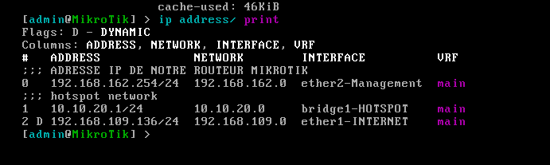

Adresse IP configurée sur l'interface de management.

---

## 2.4 Vérification de l'adresse IP

La configuration des adresses IP du MikroTik peut être vérifiée avec :

/ip address print

L'entrée correspondant à "ether2" doit apparaître avec l'adresse :

192.168.162.254/24

Cette vérification permet de confirmer que l'interface de management possède bien l'adresse attendue.

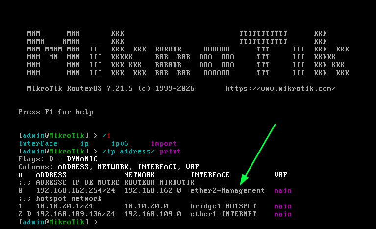

Vérification de l'adresse IP du réseau de management.

---

## 2.5 Accès au MikroTik depuis le PC hôte

Une fois le réseau "VMnet1" opérationnel, le PC hôte peut communiquer avec le MikroTik via son adresse de management.

Un test de connectivité peut être effectué depuis le PC hôte avec :

ping 192.168.162.254

Une réponse correcte confirme que la communication IP entre le PC hôte et l'interface "ether2" du MikroTik est fonctionnelle.

Cette vérification constitue un premier contrôle avant l'utilisation des outils d'administration tels que WinBox ou les accès en ligne de commande.

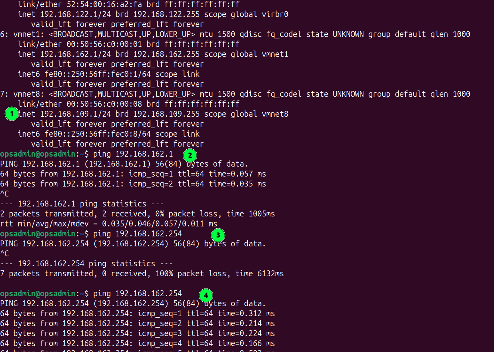

Test de connectivité entre le PC hôte et le MikroTik.

---

## 2.6 Configuration du DHCP du réseau de management

Un serveur DHCP a également été configuré sur "ether2" afin de permettre l'attribution automatique d'adresses IP aux équipements connectés au réseau de management.

Le plan d'adressage retenu est le suivant :

Élément| Valeur
Réseau| "192.168.162.0/24"
MikroTik| "192.168.162.254"
Pool DHCP| "192.168.162.10 - 192.168.162.100"
Interface| "ether2"

## 2.6.1 Création du pool DHCP

Le pool d'adresses utilisé par le serveur DHCP est créé avec :

/ip pool add name=pool-management ranges=192.168.162.10-192.168.162.100

Ce pool définit la plage d'adresses pouvant être attribuées automatiquement aux clients du réseau de management.

## 2.6.2 Création du réseau DHCP

Les paramètres du réseau DHCP sont ensuite définis avec :

/ip dhcp-server network add address=192.168.162.0/24 gateway=192.168.162.254

La passerelle distribuée aux clients est donc l'adresse IP de l'interface "ether2" du MikroTik :

192.168.162.254

## 2.6.3 Création du serveur DHCP

Le serveur DHCP est associé à l'interface "ether2" :

/ip dhcp-server add name=dhcp-management interface=ether2 address-pool=pool-management disabled=no

Le fonctionnement est alors le suivant :

Client
   │
   │ DHCP
   ▼
ether2
MikroTik
   │
   ├── Adresse distribuée :
   │   192.168.162.10 - 192.168.162.100
   │
   └── Passerelle :
       192.168.162.254

---

## 2.7 Vérification du serveur DHCP

La présence du serveur DHCP peut être vérifiée avec :

/ip dhcp-server print

Le serveur "dhcp-management" doit apparaître comme actif sur l'interface "ether2".

Le pool DHCP peut être vérifié avec :

/ip pool print

Une attribution d'adresse à un client peut également être vérifiée avec :

/ip dhcp-server lease print

Cette commande permet notamment de vérifier qu'un équipement connecté au réseau de management a bien obtenu une adresse située dans la plage :

192.168.162.10 - 192.168.162.100

Captures d'écran à intégrer :

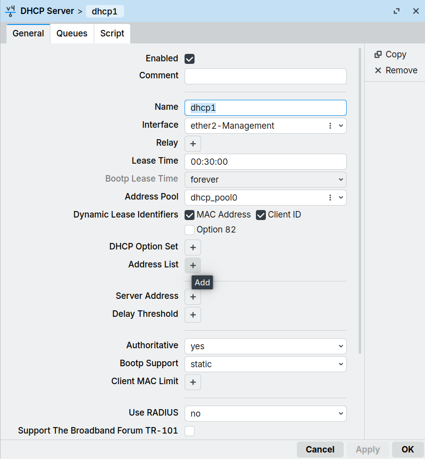

Configuration du serveur DHCP sur le réseau de management.

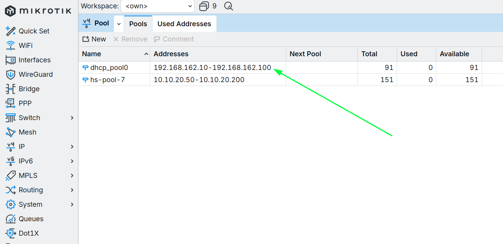

Pool d'adresses utilisé par le DHCP du réseau de management.

---

### 2.8 Résultat de la configuration

À l'issue de cette configuration, le MikroTik dispose d'un réseau de management séparé du réseau destiné aux clients du HotSpot.

Le fonctionnement obtenu est le suivant :

                    LABORATOIRE VIRTUALISÉ

        PC hôte
           │
           │ VMnet1 — Host-Only
           │ 192.168.162.0/24
           │
           ▼
      ┌───────────────┐
      │    MikroTik   │
      │               │
      │ ether2        │
      │ 192.168.162.254
      └───────────────┘

        Réseau dédié à
        l'administration

Le réseau "192.168.162.0/24" est ainsi utilisé pour les besoins de management du routeur, tandis que le réseau destiné aux clients du HotSpot reste indépendant.

Cette séparation constitue la base du reste de la configuration du lab : le management, le HotSpot et le WAN sont traités comme des réseaux distincts.

---

## 3. Configuration du réseau WAN

## 3.1 Objectif

L'interface "ether1" du MikroTik est utilisée comme interface WAN.

Elle assure la connexion du routeur vers le réseau extérieur à travers le réseau NAT de VMware.

Cette interface est distincte du réseau de management configuré sur "ether2" et du réseau destiné aux clients du HotSpot.

L'architecture retenue est donc :

                    PC hôte
                       │
                VMware Workstation
                       │
                Réseau NAT VMware
                       │
                       │ WAN
                       ▼
                    ether1
                    MikroTik

Le rôle d'"ether1" est principalement de permettre au MikroTik d'obtenir une connectivité vers l'extérieur et, par la suite, de fournir cette connectivité au réseau interne.

---

## 3.2 Raccordement de l'interface WAN

Dans VMware Workstation, la carte réseau virtuelle correspondant à "ether1" est connectée à un réseau NAT.

Le mode NAT permet à la machine virtuelle MikroTik d'accéder au réseau externe en utilisant la connectivité du PC hôte.

Le MikroTik ne reçoit donc pas ici une adresse IP statique définie manuellement. Il récupère ses paramètres réseau auprès du serveur DHCP fourni par le réseau NAT de VMware.

---

## 3.3 Configuration du client DHCP sur "ether1"

Le client DHCP de MikroTik est activé sur l'interface "ether1" avec la commande :

/ip dhcp-client add interface=ether1 disabled=no

Le MikroTik peut ainsi recevoir automatiquement :

- une adresse IP WAN ;
- un masque réseau ;
- une passerelle par défaut ;
- éventuellement les informations DNS fournies par le réseau DHCP.

L'adresse obtenue dépend du réseau NAT configuré dans VMware et peut donc varier.

---

## 3.4 Vérification de l'adresse WAN

La configuration du client DHCP peut être vérifiée avec :

/ip dhcp-client print detail

L'interface "ether1" doit apparaître avec un état indiquant que le bail DHCP a été obtenu.

L'adresse attribuée à l'interface peut également être vérifiée avec :

/ip address print

L'adresse affichée sur "ether1" correspond alors à l'adresse fournie dynamiquement par le réseau NAT de VMware.

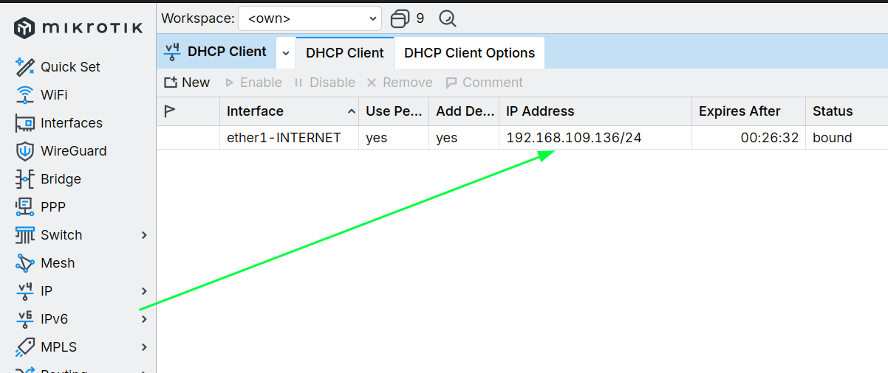

Adresse IP obtenue dynamiquement sur l'interface WAN "ether1".

---

## 3.5 Vérification de la route par défaut

L'utilisation du DHCP sur "ether1" permet également au MikroTik d'apprendre la passerelle du réseau WAN.

La table de routage peut être vérifiée avec :

/ip route print

Une route par défaut doit être présente sous la forme :

0.0.0.0/0

Cette route indique au MikroTik quelle passerelle utiliser lorsqu'une destination ne se trouve pas dans l'un de ses réseaux directement connectés.

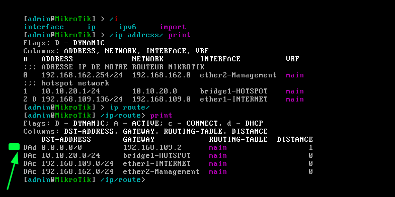

Vérification de la route par défaut vers le réseau WAN.

---

## 3.6 Test de connectivité vers l'extérieur

Une fois l'adresse WAN et la route par défaut obtenues, la connectivité vers l'extérieur peut être vérifiée directement depuis le MikroTik.

Un test peut être réalisé avec :

/ping 8.8.8.8

Une réponse indique que le MikroTik est capable de joindre une adresse IP située à l'extérieur de son réseau local.

Le test par adresse IP permet ici de vérifier la connectivité réseau indépendamment de la résolution DNS.

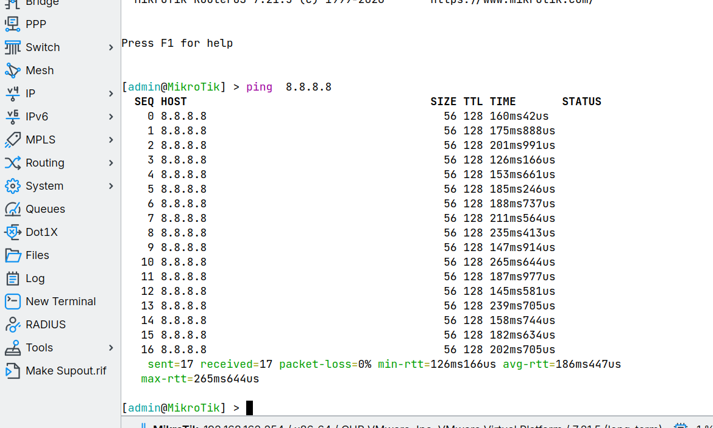

Test de connectivité du MikroTik vers l'extérieur.

---

## 3.7 Vérification de la résolution DNS

Après avoir vérifié la connectivité IP, la résolution DNS peut être testée depuis le MikroTik.

Par exemple :

/ping google.com

Si le nom de domaine est résolu et qu'une réponse est reçue, cela permet de vérifier à la fois la connectivité IP et la résolution DNS.

La configuration DNS du routeur peut être consultée avec :

/ip dns print

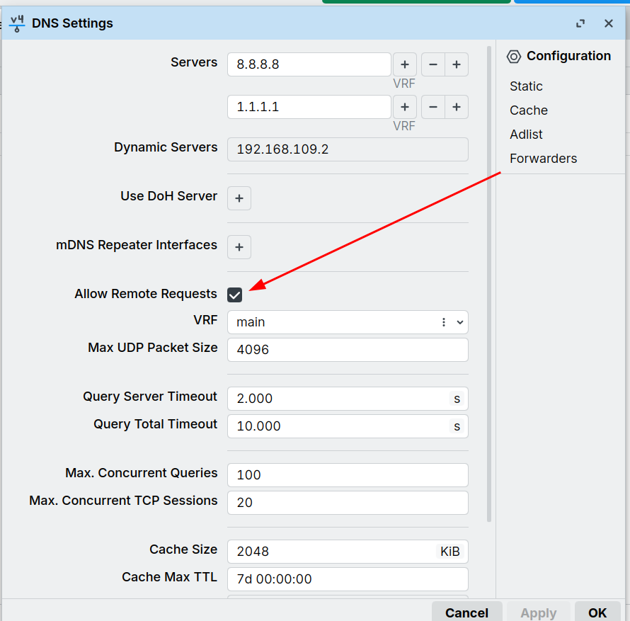

Vérification de la résolution DNS depuis le MikroTik.

---

## 3.8 Résultat de la configuration

À ce stade, le MikroTik dispose d'une connectivité WAN fonctionnelle sur "ether1".

L'architecture obtenue est la suivante :

                         INTERNET
                            │
                       VMware NAT
                            │
                            ▼
                         ether1
                            │
                    ┌──────────────┐
                    │   MikroTik   │
                    └──────────────┘
                            │
                       Réseaux internes

Le réseau WAN est ainsi séparé du réseau de management. L'interface "ether1" sert à la communication vers l'extérieur, tandis que "ether2" reste dédiée à l'administration du routeur depuis le PC hôte.

Cette connectivité WAN constitue la base nécessaire pour la configuration du réseau LAN et du service HotSpot.

---

## 4. Configuration du réseau LAN

## 4.1 Objectif

Le réseau LAN constitue le réseau destiné aux clients du lab MikroTik.

Afin de permettre à plusieurs interfaces physiques de participer au même réseau logique, les interfaces "ether3" et "ether4" sont regroupées dans un bridge.

Le réseau LAN utilisé est :

Élément| Configuration
Réseau| "10.10.20.0/24"
Passerelle| "10.10.20.1"
Interface logique| "bridge-lan"
Ports membres| "ether3", "ether4"

Le bridge constitue donc l'interface logique du réseau LAN.

---

## 4.2 Création du bridge LAN

Le bridge permet de regrouper plusieurs interfaces physiques dans un même réseau logique.

Il est créé avec :

/interface bridge add name=bridge-lan

Le "bridge-lan" devient l'interface logique qui représentera le réseau LAN.

---

## 4.3 Ajout des interfaces au bridge

Les interfaces "ether3" et "ether4" sont ensuite ajoutées au bridge :

/interface bridge port add bridge=bridge-lan interface=ether3
/interface bridge port add bridge=bridge-lan interface=ether4

L'architecture obtenue est la suivante :

                 MikroTik
                    │
              bridge-lan
               /       \
          ether3       ether4
             │            │
          Client       Client

        Réseau : 10.10.20.0/24
        Passerelle : 10.10.20.1

Les deux interfaces physiques appartiennent désormais au même réseau logique.

---

## 4.4 Vérification du bridge

Pour vérifier que le bridge a bien été créé :

/interface bridge print

Pour vérifier les interfaces associées au bridge :

/interface bridge port print

Les interfaces "ether3" et "ether4" doivent apparaître comme ports du "bridge-lan".

Cette vérification permet de confirmer que les deux interfaces physiques participent bien au même domaine de niveau 2.

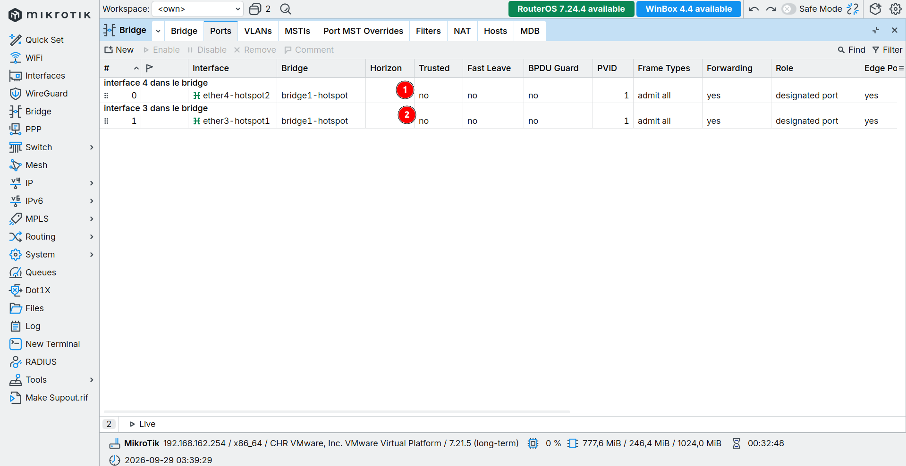

Vérification du bridge LAN et de ses interfaces membres.

---

## 4.5 Configuration de l'adresse IP du LAN

L'adresse IP de passerelle est configurée sur le bridge et non directement sur "ether3" ou "ether4".

/ip address add address=10.10.20.1/24 interface=bridge-lan

Vérification :

/ip address print

L'adresse "10.10.20.1/24" doit apparaître sur l'interface "bridge-lan".

«Important : "10.10.20.0/24" représente l'adresse du réseau. Elle ne doit pas être attribuée à l'interface. L'adresse utilisée par le MikroTik comme passerelle est "10.10.20.1/24".»

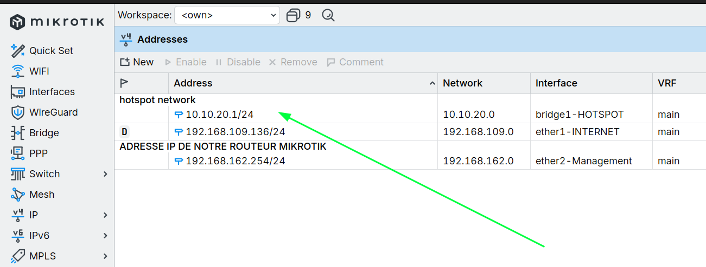

Adresse IP du réseau LAN configurée sur "bridge-lan".

---

## 4.6 Test de connectivité

Depuis un équipement connecté au réseau LAN, la passerelle doit être joignable :

ping 10.10.20.1

Une réponse confirme que le client peut communiquer avec l'interface LAN du MikroTik.

---

## 4.7 Résultat de la configuration

À ce stade, le réseau LAN est organisé autour d'un bridge regroupant "ether3" et "ether4".

La configuration obtenue est :

ether3 ─┐
        │
        ├── bridge-lan ── 10.10.20.1/24
        │
ether4 ─┘

Le "bridge-lan" servira ensuite d'interface logique pour les services du réseau LAN, notamment le serveur DHCP et le HotSpot MikroTik.

---

## 5. Configuration du DHCP sur le réseau LAN

## 5.1 Objectif

Le réseau LAN doit pouvoir attribuer automatiquement une configuration IP aux équipements qui s'y connectent.

Pour cela, un serveur DHCP est configuré sur le MikroTik.

Le DHCP permet notamment de fournir automatiquement aux clients :

- une adresse IP ;
- le masque du réseau ;
- la passerelle par défaut ;
- les paramètres nécessaires à leur communication sur le réseau.

Dans le laboratoire, le réseau LAN utilisé est :

Réseau       : 10.10.20.0/24
Passerelle   : 10.10.20.1
Interface    : bridge-lan

Le serveur DHCP est donc associé au "bridge-lan" et non directement à "ether3" ou "ether4".

---

## 5.2 Création du pool d'adresses

Le pool DHCP définit la plage d'adresses que le MikroTik pourra attribuer automatiquement aux clients.

Le pool est créé avec :

/ip pool add name=pool-lan ranges=10.10.20.2-10.10.20.253

La plage utilisée est donc :

10.10.20.2 - 10.10.20.253

L'adresse "10.10.20.1" n'est pas incluse dans le pool puisqu'elle est utilisée par le MikroTik comme passerelle du réseau LAN.

Le principe est donc :

10.10.20.0      → Adresse réseau
10.10.20.1      → MikroTik / passerelle
10.10.20.2      → Première adresse disponible pour les clients
...
10.10.20.253    → Dernière adresse disponible pour les clients
10.10.20.255    → Adresse de broadcast

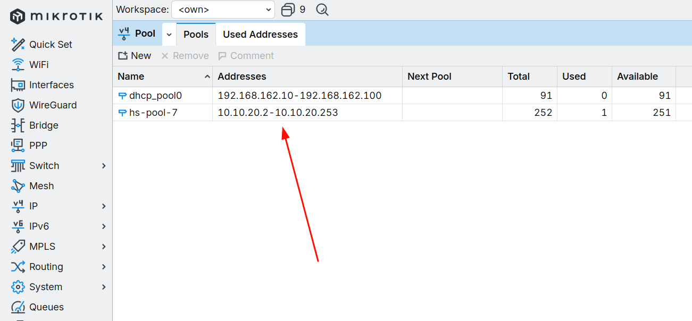

Plage d'adresses définie pour le DHCP du réseau LAN.

---

## 5.3 Configuration du réseau DHCP

Le réseau distribué par le serveur DHCP est ensuite défini avec :

/ip dhcp-server network add address=10.10.20.0/24 gateway=10.10.20.1

Le MikroTik indique ainsi aux clients que leur passerelle par défaut est :

10.10.20.1

Cette adresse correspond à l'adresse IP configurée sur "bridge-lan".

---

## 5.4 Création du serveur DHCP

Le serveur DHCP est associé à l'interface logique "bridge-lan" :

/ip dhcp-server add name=dhcp-lan interface=bridge-lan address-pool=pool-lan disabled=no

Le serveur DHCP écoute donc les requêtes des clients connectés à "ether3" ou "ether4" à travers le bridge.

Le fonctionnement est alors :

                  bridge-lan
                 /          \
            ether3          ether4
               │               │
             Client          Client
               │               │
               └──────┬────────┘
                      │
                    DHCP
                      │
                      ▼
              10.10.20.2 - 10.10.20.253
                      │
                      ▼
               Passerelle :
                10.10.20.1

---

## 5.5 Vérification du serveur DHCP

La configuration du serveur DHCP peut être vérifiée avec :

/ip dhcp-server print

Le serveur "dhcp-lan" doit apparaître comme actif sur l'interface "bridge-lan".

La configuration du pool peut être vérifiée avec :

/ip pool print

Une capture peut être ajoutée pour documenter ces paramètres.

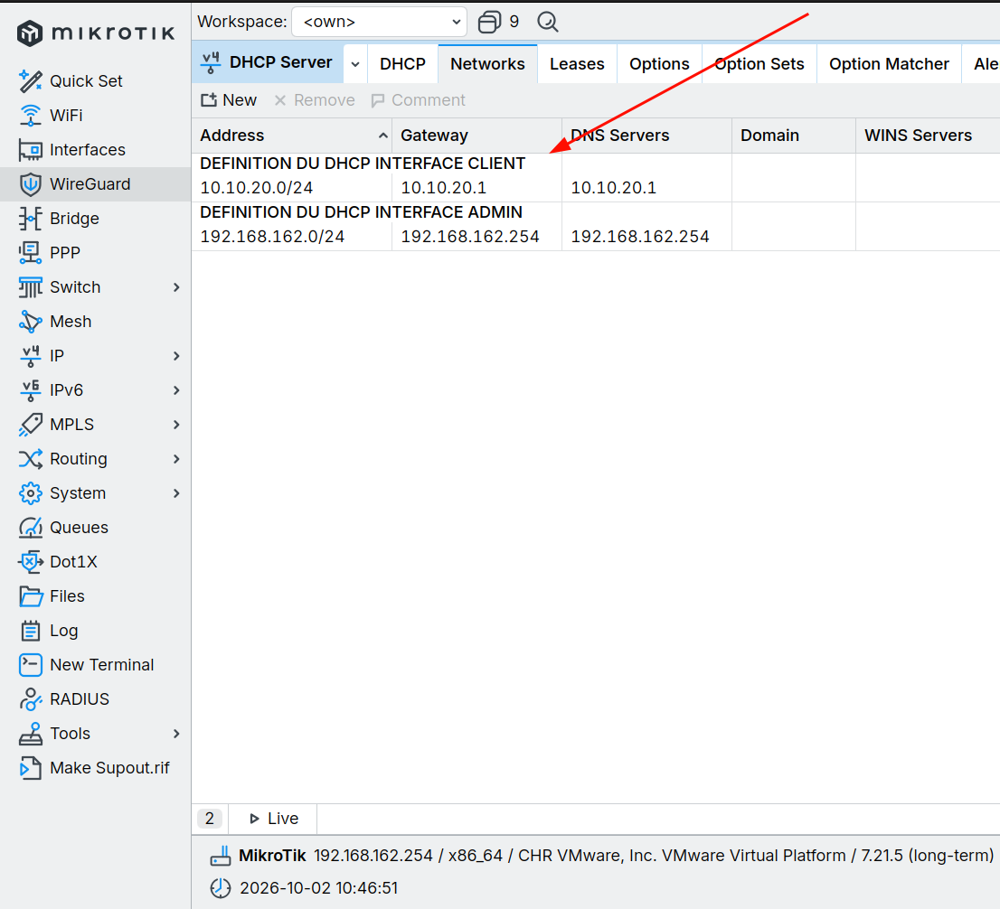

Serveur DHCP configuré sur l'interface "bridge-lan".

---

## 5.6 Vérification des baux DHCP

Lorsqu'un client demande une adresse IP, le MikroTik crée un bail DHCP.

Les baux peuvent être consultés avec :

/ip dhcp-server lease print

Cette commande permet de vérifier qu'un client connecté au réseau LAN a bien reçu une adresse appartenant à la plage configurée.

Par exemple :

Adresse IP       : 10.10.20.x
Réseau           : 10.10.20.0/24
Passerelle       : 10.10.20.1

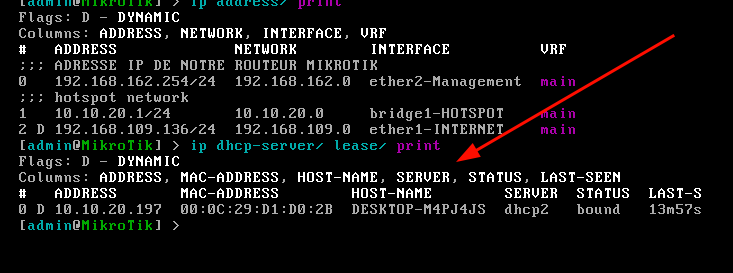

Vérification des baux DHCP attribués aux clients.

---

## 5.7 Vérification depuis un client

Depuis un équipement connecté à "ether3" ou "ether4", la configuration réseau obtenue automatiquement peut être vérifiée.

Sous Windows :

ipconfig

Le client doit recevoir une adresse appartenant au réseau :

10.10.20.0/24

avec comme passerelle :

10.10.20.1

Un test vers la passerelle peut ensuite être effectué :

ping 10.10.20.1

Une réponse confirme que le client communique correctement avec le MikroTik.

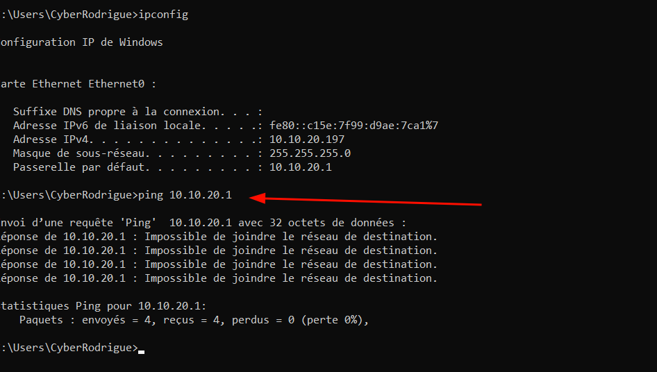

Configuration IP obtenue automatiquement par un client LAN.

---
 
## 5.8 Résultat de la configuration

À ce stade, le réseau LAN dispose d'un service DHCP fonctionnel.

L'architecture est maintenant :

                         INTERNET
                            │
                        VMware NAT
                            │
                         ether1
                            │
                    ┌──────────────┐
                    │   MikroTik   │
                    └──────────────┘
                       │          │
                    ether2    bridge-lan
                       │          │
                  Management   /        \
                              ether3   ether4
                                │        │
                                └──┬─────┘
                                   │
                            10.10.20.0/24
                                   │
                              DHCP actif
                                   │
                                Clients
                                

Les clients connectés à "ether3" ou "ether4" peuvent désormais obtenir automatiquement leur configuration IP auprès du MikroTik.

Le réseau est ainsi prêt pour la mise en place du HotSpot MikroTik et de son mécanisme d'authentification.

---

## 6. Configuration du HotSpot MikroTik

## 6.1 Objectif

Le service HotSpot est mis en place sur le réseau LAN représenté par "bridge-lan".

Son objectif est de contrôler l'accès des clients au réseau en leur imposant une authentification avant de leur permettre d'accéder aux ressources réseau autorisées.

Contrairement au DHCP configuré précédemment, qui fournit uniquement une configuration IP aux clients, le HotSpot ajoute une couche de contrôle d'accès et d'authentification.

Le fonctionnement général est le suivant :

Client
   │
   │ Connexion au réseau LAN
   ▼
bridge-lan
   │
   │ DHCP
   ▼
Adresse IP
   │
   │ Tentative d'accès Web
   ▼
Portail HotSpot
   │
   │ Authentification
   ▼
Accès autorisé

---

## 6.2 Interface utilisée par le HotSpot

Le HotSpot est installé sur l'interface logique "bridge-lan".

Cette interface représente le réseau LAN :

Interface    : bridge-lan
Réseau       : 10.10.20.0/24
Passerelle   : 10.10.20.1

Les interfaces "ether3" et "ether4" sont des ports membres du bridge.

Le réseau de management "ether2" n'est pas concerné par le HotSpot.

Cette séparation permet de conserver l'accès d'administration au MikroTik indépendamment de l'authentification imposée aux clients.

---

## 6.3 Lancement de l'assistant HotSpot

La configuration peut être réalisée à l'aide de l'assistant intégré à RouterOS :

/ip hotspot setup

Lors de l'exécution de l'assistant, l'interface sélectionnée doit être :

bridge-lan

Le réseau utilisé correspond au LAN :

10.10.20.0/24

L'adresse de la passerelle du HotSpot est :

10.10.20.1

L'assistant permet ensuite de définir les paramètres nécessaires au fonctionnement du portail captif.

---

## 6.4 Sélection de l'interface

Lors de l'exécution de :

/ip hotspot setup

l'interface "bridge-lan" est sélectionnée comme interface HotSpot.

Cette étape est importante car elle détermine sur quel réseau le mécanisme d'authentification sera appliqué.

Le HotSpot ne doit donc pas être installé sur :

ether1 → WAN
ether2 → Management

mais sur :

bridge-lan → LAN / HotSpot

Les clients connectés à "ether3" et "ether4" sont ainsi concernés par le HotSpot via le bridge.

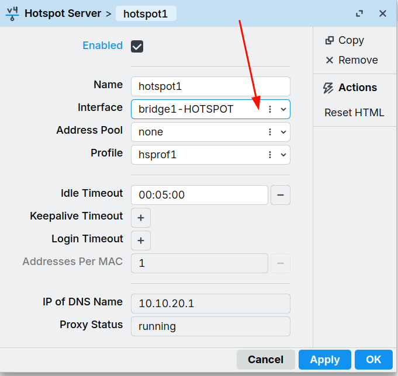

Sélection de l'interface "bridge-lan" lors de la configuration du HotSpot.

---

## 6.5 Configuration de l'adresse du HotSpot

L'assistant utilise l'adresse de l'interface LAN comme passerelle du HotSpot :

10.10.20.1/24

Il est important de distinguer cette adresse de l'adresse du réseau :

10.10.20.0/24 → réseau
10.10.20.1/24 → passerelle MikroTik

Les clients connectés au réseau reçoivent donc une adresse dans :

10.10.20.0/24

avec :

Passerelle : 10.10.20.1

---

## 6.6 Configuration du pool d'adresses

Le HotSpot peut utiliser le pool d'adresses déjà défini pour le réseau LAN.

Dans le laboratoire, la plage disponible pour les clients est :

10.10.20.2 - 10.10.20.253

Le MikroTik peut ainsi attribuer une adresse IP aux clients avant leur authentification.

Il est important de distinguer deux mécanismes :

DHCP
  ↓
Fournit la configuration IP

HotSpot
  ↓
Contrôle l'accès et l'authentification

L'obtention d'une adresse IP ne signifie donc pas encore que l'utilisateur est authentifié auprès du HotSpot.

---

## 6.7 Configuration du certificat SSL

Lors de la configuration du HotSpot, RouterOS demande également le certificat à utiliser pour les connexions sécurisées.

Dans le cadre de ce laboratoire, la configuration est réalisée avec le certificat disponible dans RouterOS.

Le certificat permet notamment au HotSpot de prendre en charge les connexions HTTPS lorsque cette fonctionnalité est utilisée.

Paramètre du certificat lors de la configuration du HotSpot.

---

## 6.8 Configuration du serveur SMTP

L'assistant demande également l'adresse du serveur SMTP.

Dans le cadre de ce laboratoire, ce paramètre n'est pas utilisé pour le fonctionnement principal du portail captif.

La valeur peut donc être conservée selon la configuration retenue lors de l'assistant.

---

## 6.9 Configuration du serveur DNS

Le HotSpot nécessite également un serveur DNS pour permettre aux clients de résoudre les noms de domaine.

Le MikroTik peut utiliser les serveurs DNS configurés dans RouterOS.

La configuration peut être consultée avec :

/ip dns print

Le paramètre "allow-remote-requests" doit être configuré correctement si le MikroTik doit répondre aux requêtes DNS des clients.

La configuration DNS peut être vérifiée avec :

/ip dns print

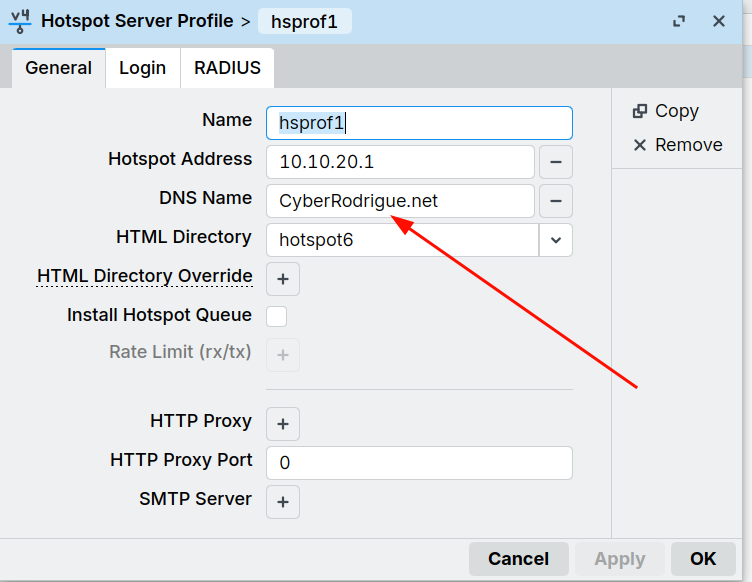

Vérification de la configuration DNS utilisée par le HotSpot.

---

## 6.10 Nom du domaine HotSpot

L'assistant demande également un nom DNS pour le serveur HotSpot.

Ce nom est utilisé dans le fonctionnement du portail captif.

Le nom défini lors de la configuration est conservé dans la configuration RouterOS.

Il peut être vérifié avec :

/ip hotspot profile print

Cette commande permet notamment de consulter le profil associé au HotSpot.

---

## 6.11 Création du premier utilisateur

Après la configuration du HotSpot, un compte utilisateur peut être créé afin de tester l'authentification.

La commande générale est :

/ip hotspot user add name=<nom_utilisateur> password=<mot_de_passe>

Le compte créé est ensuite utilisé depuis le portail captif.

Pour consulter les utilisateurs configurés :

/ip hotspot user print

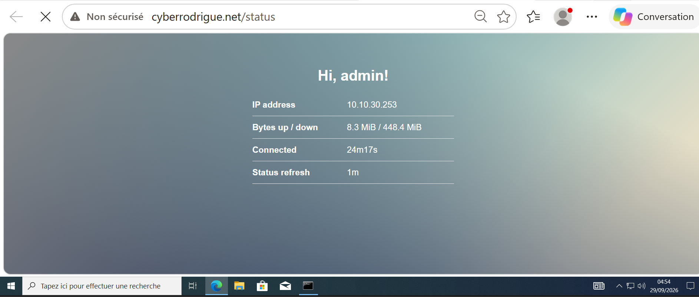

Utilisateur configuré pour l'authentification HotSpot.

---

## 6.12 Vérification du service HotSpot

La présence du serveur HotSpot peut être vérifiée avec :

/ip hotspot print

Le serveur doit être associé à :

bridge-lan

Les profils HotSpot peuvent être consultés avec :

/ip hotspot profile print

Les utilisateurs peuvent être vérifiés avec :

/ip hotspot user print

Ces commandes permettent de contrôler les principaux éléments de la configuration.

---

## 6.13 Test depuis un client

Un client est connecté au réseau LAN via "ether3" ou "ether4".

Après l'obtention de son adresse IP par DHCP, une tentative d'accès à une ressource Web doit provoquer la redirection vers le portail HotSpot lorsque le client n'est pas encore authentifié.

Le scénario attendu est :

Client
   │
   │ DHCP
   ▼
10.10.20.x
   │
   │ Requête Web
   ▼
MikroTik HotSpot
   │
   │ Client non authentifié
   ▼
Portail de connexion
   │
   │ Identifiant + mot de passe
   ▼
Authentification réussie
   │
   ▼
Accès réseau autorisé

Portail d'authentification du HotSpot MikroTik.

---

## 6.14 Vérification d'un utilisateur connecté

Une fois l'authentification effectuée, les utilisateurs actuellement connectés peuvent être consultés avec :

/ip hotspot active print

Cette commande permet notamment d'observer les sessions HotSpot actives.

On peut y retrouver les informations associées au client connecté, notamment son adresse IP et son identifiant.

Vérification d'une session HotSpot active.

---

## 6.15 Résultat de la configuration

Après cette étape, le réseau LAN dispose du service HotSpot.

L'architecture fonctionnelle du laboratoire est la suivante :

                              INTERNET
                                  │
                              VMware NAT
                                  │
                               ether1
                                  │
                         ┌────────────────┐ge
                         
                         
                         │    MikroTik    │
                         └────────────────┘
                            │          │
                         ether2     bridge-lan
                            │          │
                       Management    /       \
                            │       /         \
                    192.168.162.0/24      ether3  ether4
                                        │        │
                                        └───┬────┘
                                            │
                                      10.10.20.0/24
                                            │
                                          DHCP
                                            │
                                         Client
                                            │
                                         HotSpot
                                            │
                                      Portail captif
                                            │
                                      Authentification
                                            │
                                      Accès réseau

Le MikroTik joue ainsi plusieurs rôles dans le laboratoire :

- "ether1" assure la connectivité WAN ;
- "ether2" fournit le réseau de management ;
- "ether3" et "ether4" sont regroupés dans "bridge-lan" ;
- "bridge-lan" constitue l'interface logique du réseau LAN ;
- le DHCP fournit automatiquement la configuration IP aux clients ;
- le HotSpot contrôle leur authentification avant l'accès au réseau.

La séparation entre les différents réseaux permet ainsi de disposer d'une architecture claire :

WAN
│
└── ether1
    │
    ▼
  MikroTik
    │
    ├── ether2
    │   └── Management
    │       192.168.162.0/24
    │
    └── bridge-lan
        ├── ether3
        └── ether4
            │
            └── LAN / HotSpot
                10.10.20.0/24

À ce stade, le lab dispose donc d'une connectivité WAN, d'un réseau de management séparé, d'un réseau LAN regroupant "ether3" et "ether4", d'un service DHCP et d'un portail HotSpot avec authentification.

La prochaine étape consiste à poursuivre les tests du réseau et à documenter leb
